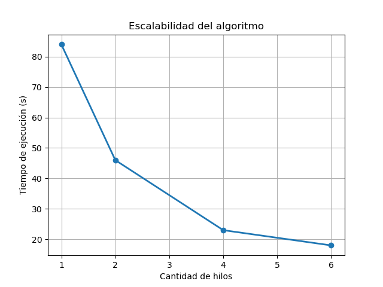
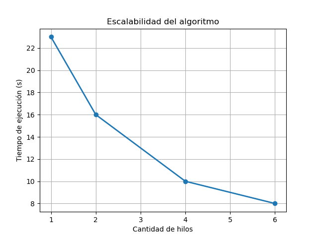

# TP1 - Programación Concurrente

**Alumno**: Jonathan Dominguez

**Padrón**: 110057

**Dataset utilizado**: [Anime Dataset 2023](https://www.kaggle.com/datasets/dbdmobile/myanimelist-dataset?select=final_animedataset.csv)

Este dataset "final_animedataset.csv" recopila la informacion de los usuarios que califican animes y los datos de los mismos.

Cada set contiene los campos de:

| username          | anime_id     | my_score            | user_id        | gender              |
| ------------------- | -------------- | --------------------- | ---------------- | --------------------- |
| Nombre de usuario | ID del anime | Puntaje del usuario | ID del usuario | Género del usuario |

| tittle            | type                                 | source                             | score                               | scored_by                             | rank                                              | popularity               | genre                                         |
| ------------------- | -------------------------------------- | ------------------------------------ | ------------------------------------- | --------------------------------------- | --------------------------------------------------- | -------------------------- | ----------------------------------------------- |
| Título del anime | Tipo de anime (serie, pelicula, etc) | Origen (manga, novela ligera, etc) | Puntaje promedio que tiene el anime | Cantidad de personas que lo puntuaron | En que top está el anime, siendo el 1° el mejor | La popularidad del anime | Los géneros del anime (romance, terror, etc) |

Para el fin de este trabajo los campos usados van a ser los siguentes:

```rust
pub struct AnimeData {
    pub anime_id: u32,
    pub title: String,
    pub anime_type: String,
    pub source: String,
    pub genres: HashSet<String>,
}
```

Opté por descartar campos innecesarios como por ejemplo el ranking, la popularidad, entre otros.

## Ejecución

```bash
cargo run <ruta dataset> <cantidad de threads> <nombre de salida>
```

Ejemplo de ejecución:

```bash
cargo run tp1/dataset/anime.csv 2 top.json
```

## Decisiones tomadas

### Arquitectura y Paralelización

- **División en shards**: Se decidió dividir el dataset en archivos más pequeños (50MB) para permitir procesamiento paralelo eficiente
- **Paralelización con Rayon**: Se utilizó `rayon` para paralelizar tanto el procesamiento de shards como las transformaciones finales
- **Merge optimizado**: Se implementó un merge paralelo de los mapas locales para evitar trabajar todos sobre el mismo mapa

### Optimizaciones de Rendimiento

- **Uso de `FxHasher`**: Se implementó un hash más rápido que el HashMap estándar

### Gestión de Memoria

- **Capacidad pre-allocada**: Se establecieron capacidades iniciales para HashMaps basadas en el tamaño esperado de datos

### Estructura de Datos

- **AnimeDataWrapper**: Se creó una estructura wrapper para acumular scores y counts de manera eficiente
- **Transformaciones paralelas**: Se implementaron las transformaciones de animes y géneros en paralelo usando `rayon::join()`

## Transformaciones

Las dos transformaciones que busco son:

- Top 3 animes mejores valorados: en base al promedio busco los 3 con mayor puntaje.

El resultado esperado es:

```json
"top_animes": {
    "data": [
        {
        "anime_id": 1535,
        "anime_type": "TV",
        "average_score": 7.37533712387085,
        "genres": [
          "Mystery",
          "Police",
          "Psychological",
          "Shounen",
          "Supernatural",
          "Thriller"
        ],
        "source": "Manga",
        "title": "Death Note"
        },
        {
        "anime_id": 199,
        "anime_type": "Movie",
        "average_score": 7.309428691864014,
        "genres": [
          "Adventure",
          "Drama",
          "Supernatural"
        ],
        "source": "Original",
        "title": "Sen to Chihiro no Kamikakushi"
        },
        {
        "anime_id": 2904,
        "anime_type": "TV",
        "average_score": 7.297047138214111,
        "genres": [
          "Action",
          "Drama",
          "Mecha",
          "Military",
          "Sci-Fi",
          "Super Power"
        ],
        "source": "Original",
        "title": "Code Geass: Hangyaku no Lelouch R2"
        }
    ],
    "description": "Top 3 animes con mejor puntuación promedio"
}
```

- Top 5 géneros más vistos: en base a la cantidad de apariciones de cada género me quedo con los más repetidos.

El resultado esperado es:

```json
"top_genres": {
    "data": [
        {
        "genre": "Comedy",
        "total_views": 17230104
        },
        {
        "genre": "Action",
        "total_views": 14075383
        },
        {
        "genre": "Romance",
        "total_views": 10543961
        },
        {
        "genre": "Drama",
        "total_views": 9889220
        },
        {
        "genre": "Fantasy",
        "total_views": 8766590
        }
    ],
    "description": "Top 5 géneros más vistos"
}
```

## Tests

Para correr los test:

```bash
cargo test
```

## Performance

Para medir el performance del programa se tuvo 3 cosas en cuenta:

- Se comparó el programa en estado debug y release.
- No se consideró el tiempo que tarda el programa en separar el archivo en varios.
- Se hizo un promedio de los tiempos y se los redondeó hacia arriba.

### Modo Debug



### Modo Release



El programa en modo release es casi un 300% más rápido que el debug.

Como observación, splittear el archivo en modo debug tardó 70 segundos mientras que en modo release tardó 35 segundos.

## Conclusiones

El sistema funciona bien una vez que ya tenemos el archivo splitteado, pero si el archivo es chico probablemente no sea la mejor opción. El problema es que particionar el archivo es lento, pero después las consultas son rápidas porque cada hilo lee su mini archivo y tenemos procesamiento en paralelo sin cargar todo en memoria.

La pregunta es: ¿qué conviene más? ¿Esperar que se splittee el archivo (35s en release) y después tener procesamiento rápido, o procesar directamente el archivo por chunks cargando más datos en memoria?

Para archivos grandes (como el dataset de anime que usé), el enfoque actual considero que está bien. El tiempo de splitting se compensa con el paralelismo. Además, si necesito hacer múltiples consultas sobre el mismo dataset, solo splitteo una vez.

Para archivos chicos (digamos menos de 300MB), probablemente sea más rápido procesarlo directo en memoria por chunks. El overhead del I/O de crear archivos temporales termina siendo mayor que el beneficio.
